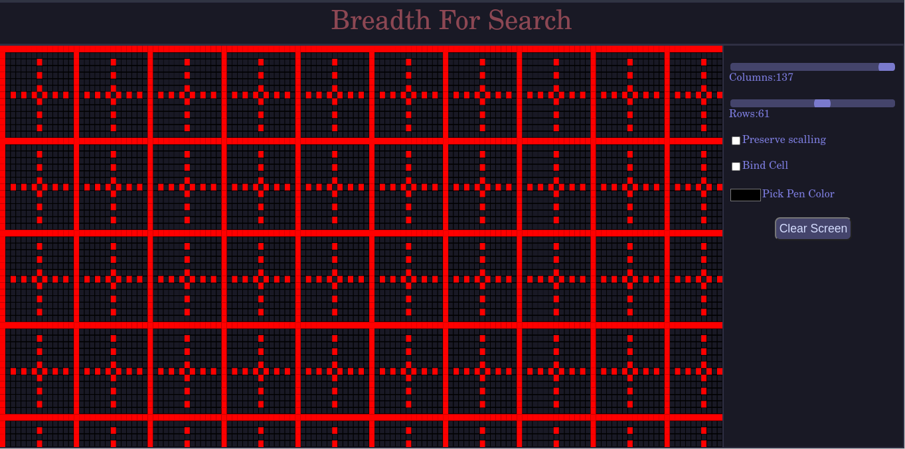

# Basic HTML CANAS GRID

## demo



# Avilable Functions

## `colorCell(canvas,context, x, y, color)`
    context and canvas are global variable that are already provided,
    but you can chose your own context and canvas,
    x and y are the postion on the grid to draw with the `color`
    (ie any color supported by CSS:-red,#ff0f00...)

## `colorCellByIndex(canvas,context, x, y, color)`
    context and canvas are global variable that are already provided,
    but you can chose your own context and canvas,
    xi and yi are the index of cell on the grid to draw with the `color`
    (ie any color supported by CSS:-red,#ff0f00...)

## Examples:-
```js

canvas.addEventListener('click',()=>{
        colorCell(canvas,context, event.pageX ,event.pageY,penColor)
})
```
```js
for (var yi = 0; yi < GRID.rows; yi++) {
        for (var xi = 0; xi < GRID.cols; xi++) {
            if ((yi * xi)%14 ==0 )
                colorCellByIndex(canvas, context, xi, yi, "red")
        }
    }
```